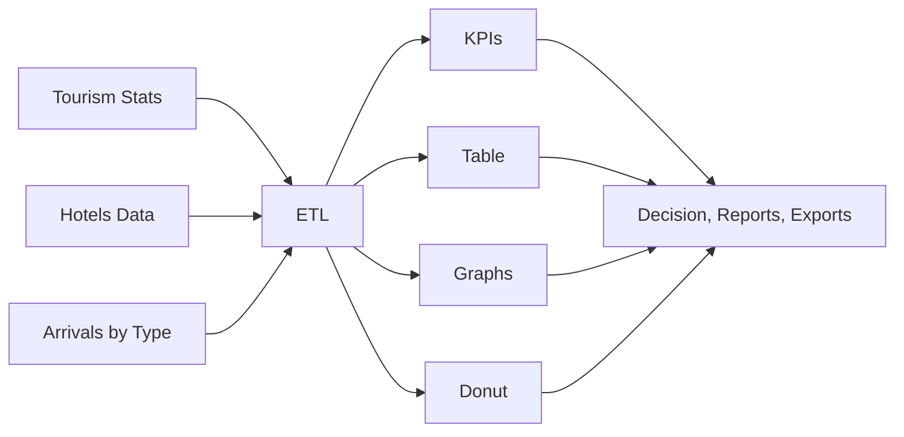

# 🗺️ Tourism Intelligence Dashboard

An interactive, visually-rich analytics dashboard for city-level tourism data—offering real‑time KPIs, domestic/international tourist breakdown, dynamic hotel/occupancy review, and actionable visualizations for smarter planning.

***

## 📸 Demo


***

## 📒 Table of Contents

- [About the Project](#about-the-project)
- [Key Features](#key-features)
- [Architecture & Flowcharts](#architecture--flowcharts)
- [Setup & Installation](#setup--installation)
- [Usage](#usage)
- [Use Cases](#use-cases)
- [Contributing](#contributing)
- [License](#license)
- [Contact](#contact)

***

## 📝 About the Project

Tourism Intelligence Dashboard brings together all vital metrics—arrivals, revenue, hotel data, domestic/international split—across multiple cities, in an easy-to-use web interface. Its goal: empower cities, hotels, and agencies to make data-driven decisions and respond proactively to tourism trends.

***

## ✨ Key Features

- **KPI Cards**: Total arrivals, revenue, average hotel occupancy  
- **Tourist Breakdown**: Domestic and International, shown numerically and as a donut chart  
- **Hotel Data Table**: Name, Stars, Rooms, Price/Night, Occupancy  
- **Charts**:  
  - Trend chart (Arrivals, Revenue, Occupancy, Domestic/International over last 6 months)  
  - Hotel occupancy comparison (bar chart)  
  - Donut chart for tourist split  
- **Dynamic Selection**: Instantly updates all visuals based on city/month/year  
- **Responsive Design**: Modern UI, city-themed colors, animated, and fast

***

## 🔗 Architecture & Flowcharts

### 1️⃣ System Workflow


### 2️⃣ Data Pipeline



***

## ⚙️ Setup & Installation

1. **Clone this repo**  
   ```bash
   git clone https://github.com/your-username/tourism-intelligence-dashboard.git
   cd tourism-intelligence-dashboard
   ```

2. **Run locally**  
   - Open `index.html` in your browser  
   - Or run a simple server:  
     ```bash
     python3 -m http.server
     ```

3. *(Optional: For real data/API integration, see `scripts/` and extend JavaScript as required)*

***

## 🚀 Usage

- Select the **city, month, and year** at the top.
- Instantly view **KPIs**, *domestic/international* stats, and the **hotel occupancy/pricing table**.
- Analyze **live graphs** updating to your selections.
- Use for:
  - Trend analysis
  - Statistical reporting
  - Visual presentations
  - Management decisions

***

## 🏆 Use Cases

- 💼 **City Planners:** Seasonal demand, resource allocation, event management  
- 🏨 **Hotels:** Compare occupancy, optimize pricing  
- 🏢 **Government:** Policy targeting, visa and campaign monitoring  
- 📊 **Business/Analytics:** Report generation, export, academic research  
- 🧑‍💼 **General:** Real-time, mobile-friendly data exploration

***

## 🤝 Contributing

- Fork the repo
- Make your feature or fix
- Create a pull request
- Suggestions/feature requests are welcome via [Issues](https://github.com/your-username/tourism-intelligence-dashboard/issues)!

***

> **Empower, Analyze, Grow — with the Tourism Intelligence Dashboard 🗺️**

***

**Feel free to add links to the actual generated PNGs of your flowcharts in the docs or reference them if rendered elsewhere.  
For advanced API/database integration or team credits, simply add extra sections!**

[1](https://github.com/topics/attendance-management-system)
[2](https://github.com/K-O-V-I-D/No-Proxy-Attendance.github.io)
[3](https://github.com/imHardik1606/RTHack)
[4](https://devfolio.co/projects/att-tracker-or-antiproxy-attendance-management-sys-029a)
[5](https://github.com/AzeemIdrisi/QR-Attendance-System)
[6](https://gist.github.com/dfm/aadf83d23c8937a2fa27)
[7](https://github.com/Patelrahul4884/Attendance-Management-system-using-face-recognition)
[8](https://github.com/topics/attendance-application)
[9](https://github.com/topics/attendance-system?l=dart)
[10](https://github.com/topics/attendance-monitoring)
